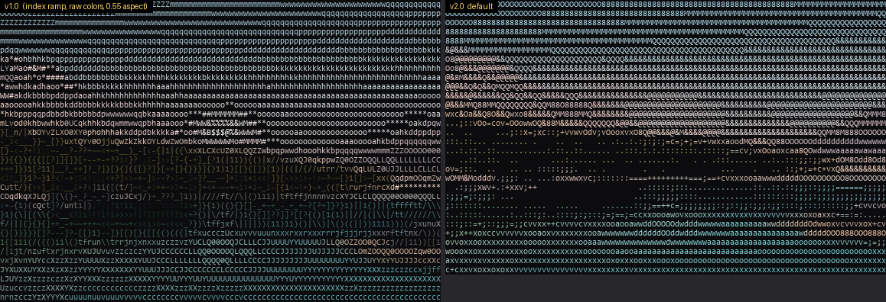
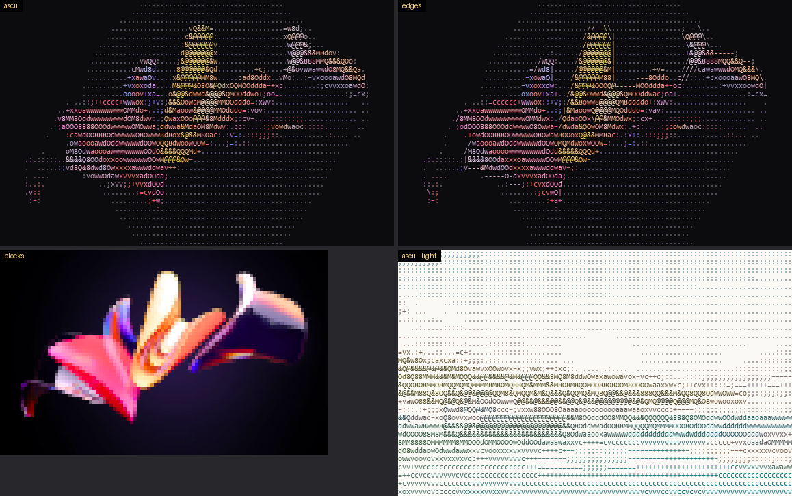
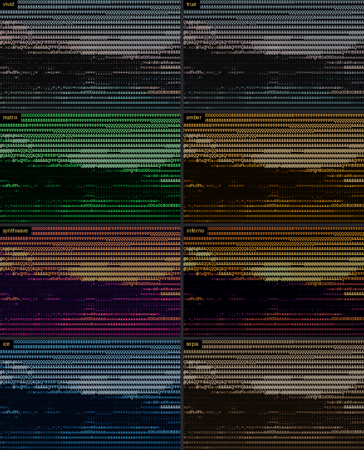

# asciify

Image → ASCII art with perceptual color. Prints straight to your terminal (truecolor, 256 or
16 colors), or exports standalone **HTML**, **PNG/WebP/JPEG**, **ANSI** or plain **text**. Ships
with a drag-and-drop **local web UI**.



| Modes | Palettes |
|---|---|
|  |  |

## Quick start

Requires Python 3.9+.

```bash
python -m venv .venv
.venv\Scripts\activate          # Windows  (macOS/Linux: source .venv/bin/activate)
pip install -e .                # installs Pillow + NumPy and the `asciify` command
```

Then:

```bash
asciify photo.jpg                                  # fit the terminal, auto color depth
asciify photo.jpg -w 200 -o art.html -o art.png    # export (repeat -o for several formats)
asciify photo.jpg -m edges -p synthwave            # contour glyphs + retro gradient
asciify photo.jpg -m blocks                        # half-block pixels, 2x vertical detail
asciify photo.jpg --light -p none -o art.txt       # for light backgrounds / plain text
asciify serve                                      # web UI at http://127.0.0.1:8765
```

No install? Run it from the project folder with `pip install -r requirements.txt` and
`python -m asciify photo.jpg`. For HEIC photos, also `pip install pillow-heif`.

### Web UI

`asciify serve` opens a local page. Drop an image anywhere, use **Choose image…**, or paste with
**Ctrl+V**, then tune mode, width, palette, ramp, contrast, gamma, saturation, ink lift, edge
threshold, cell ratio, light page and dithering. The preview re-renders live, and you can
download HTML, PNG or TXT. Nothing leaves your machine: the server binds to 127.0.0.1, refuses
foreign `Host` headers, and caps uploads at 40 MB.

### Python API

```python
from asciify import convert, Options, render

frame = convert("photo.jpg", Options(width=120, mode="ascii", palette="vivid"))
print(render.to_ansi(frame))                   # or "256" / "16" / "none"
html = render.to_html(frame, title="My art")
render.to_image(frame, font_size=14).save("art.png")
render.save(frame, "art.txt")                  # format by extension
```

`convert` accepts a path, `bytes`, or a binary file object.

## Options

| Flag | Default | Meaning |
|---|---|---|
| `-w/--width`, `-H/--height` | fit terminal / 160 for files | Columns / rows. Give one and the other follows the aspect ratio. Give both to force a size. |
| `-m/--mode` | `ascii` | `ascii` density glyphs · `edges` adds `\| / - \` along contours · `blocks` truecolor `▀` half-blocks |
| `-r/--ramp` | `detailed` | `detailed`, `standard` (Bourke 70), `simple`, `blocks`, or your own characters (sparse → dense) |
| `-p/--palette` | `vivid` | `vivid`, `true`, `none`, `mono`, `matrix`, `amber`, `synthwave`, `inferno`, `ice`, `sepia` (`--list` describes each) |
| `--light` | off | Target a light background: dense glyphs mean dark |
| `--bg #rrggbb` | theme/palette | Page background for HTML/PNG and for compositing transparency |
| `--contrast` | `1.0` | Strength of robust auto-levels (1st–99th percentile) |
| `--gamma` | auto | Tone curve; auto = 1.5 on dark pages, 1.0 on light pages and blocks |
| `--saturation` | `1.25` | Oklab chroma multiplier |
| `--lift` | `0.5` | How far `vivid` pulls ink lightness toward readable |
| `--dither` | off | Floyd–Steinberg error diffusion across glyph density levels |
| `--edge-threshold` | `0.6` | Edges mode sensitivity (lower = more contour glyphs) |
| `--cell-ratio` | `0.5` | Character cell width ÷ height of your display (tweak if circles look oval) |
| `-o FILE` | terminal | `.txt`, `.ans`, `.html`, `.png`, `.webp`, `.jpg`, … (repeatable). Add `--show` to also print. |
| `--color` | `auto` | `truecolor`, `256`, `16`, `none`. Auto honors `NO_COLOR` / `FORCE_COLOR`. |
| `--fill-bg` | off | Paint the page background in the terminal too |
| `--font`, `--font-size` | system mono, 16 | Font for image export |
| `--max-pixels` | `200` | Refuse images above this many megapixels (decompression-bomb guard) |

Input: `-` reads the image from stdin (`cat photo.png | asciify - -w 100`).

## How it works

```
header check ─► JPEG DCT downscale ─► mode/ICC normalize ─► linear-light strip reduce ─► EXIF rotate
   ─► exact area resample to the character grid (aspect-corrected)
   ─► Oklab L ─► robust auto-levels ─► gamma ─► alpha as coverage
   ─► nearest *measured* glyph density (optional dithering; edges: Sobel structure tensor)
   ─► ink color in Oklab (lift + chroma, or gradient map) ─► gamut map ─► renderer
```

1. **Aspect ratio.** Pixels are square but character cells are about twice as tall as wide:
   `rows = cols × (h / w) × cell_ratio`. Each renderer then enforces the same ratio: HTML uses
   `line-height: calc(1ch / ratio)`, which is exact in any monospace font, and PNG cells are
   `advance / ratio` tall.
2. **Scaling without blowing up.** Pillow reads only the header first, so oversized files fail
   fast. JPEGs decode at 1/2–1/8 scale in the DCT domain. Everything else is averaged in 4 MP
   strips. A 192 MP JPEG converts in 0.3 s using +56 MB.
3. **Gamma-correct sampling.** Pixels become linear light before averaging. Averaging sRGB values
   directly darkens fine detail: a black/white checkerboard should read 188, not 128.
4. **Luminosity → glyph.** The ink coverage of every printable ASCII glyph was *measured*
   (`tools/measure_glyphs.py`). Folklore ramps are not monotonic: in Consolas, Bourke's 70-char
   ramp has 30 inversions, and `@` is 33% denser than `$`. Tones map to the nearest real density.
   The default ramp ` .:;=+cvxoawdO8MQ&@` is evenly spaced and avoids directional glyphs, which
   streak flat areas.
5. **Color: ink compensation.** Even `@`, the densest glyph, inks only about 36% of its cell, so coloring it with the
   cell's mean color darkens twice (brightness ≈ coverage × color). That is where "muddy"
   ASCII art comes from. The `vivid` palette lets glyph density carry luminance and color carry
   hue. In Oklab, ink lightness is lifted toward a readable target and chroma is boosted, then
   colors are gamut-mapped by shrinking chroma at constant lightness and hue, so blues don't turn
   purple. Gradient palettes map tone to colors interpolated in Oklab. Terminal fallbacks choose
   the perceptually nearest 256- or 16-color entry.

Full research notes, the v1.0 draft, the measured flaw list and the fixes are in
[docs/REVIEW.md](docs/REVIEW.md).

## Project layout

```
asciify/
  loader.py    safe decoding: size guard, draft, ICC, linear-light reduction, EXIF, alpha
  engine.py    grid sizing, tone mapping, glyph selection, dithering, edges -> Frame
  color.py     sRGB/linear, Oklab, gamut mapping, palettes, ANSI quantization
  glyphs.py    measured coverage table, ramps, Floyd-Steinberg
  render.py    text / ANSI / HTML / raster renderers
  terminal.py  VT mode on Windows, color depth detection, UTF-8
  cli.py       command line;  server.py + webui.html  local web UI
tests/         47 regression tests (python -m unittest discover -s tests)
tools/         measure_glyphs.py, benchmark.py, showcase.py
v1/            the original draft and the probe that exposed its flaws
docs/          REVIEW.md engineering log, images
```

## Troubleshooting

* **Circles look oval in my terminal:** try `--cell-ratio 0.45` (taller cells) or `0.55`.
* **No colors:** your environment sets `NO_COLOR`, or output is piped. Force with `--color truecolor`.
* **Garbled escapes on old Windows consoles:** use Windows Terminal, or `--color none`.
* **"above the 200 MP safety limit":** raise it, e.g. `--max-pixels 500`, if you trust the file.
